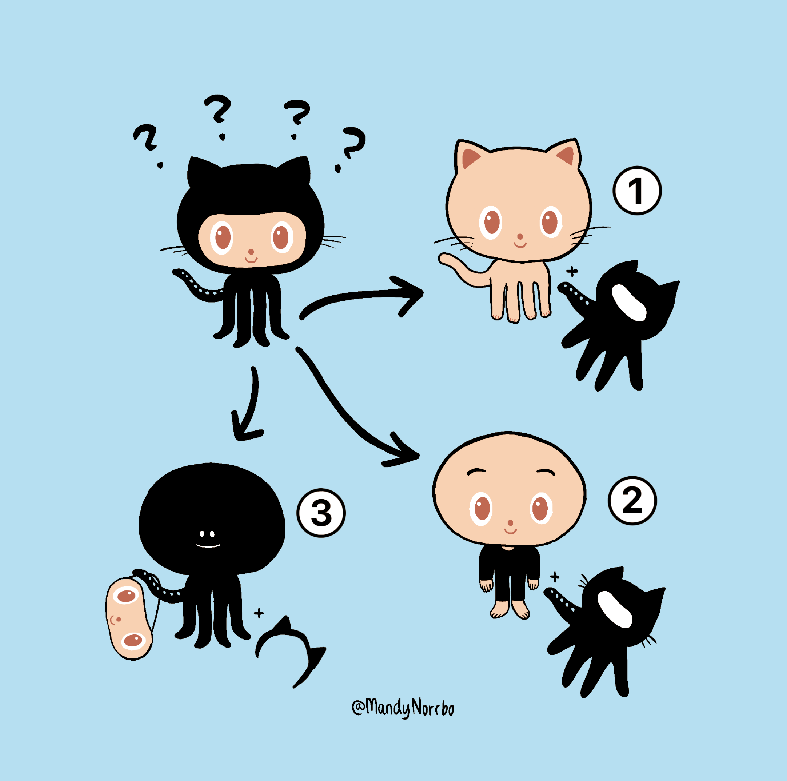
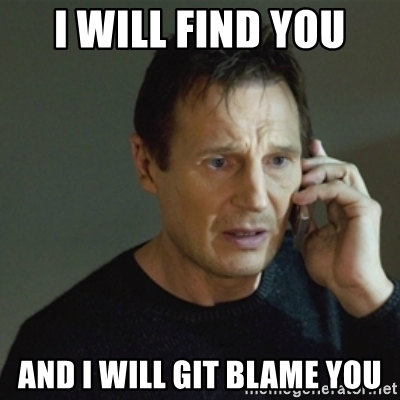
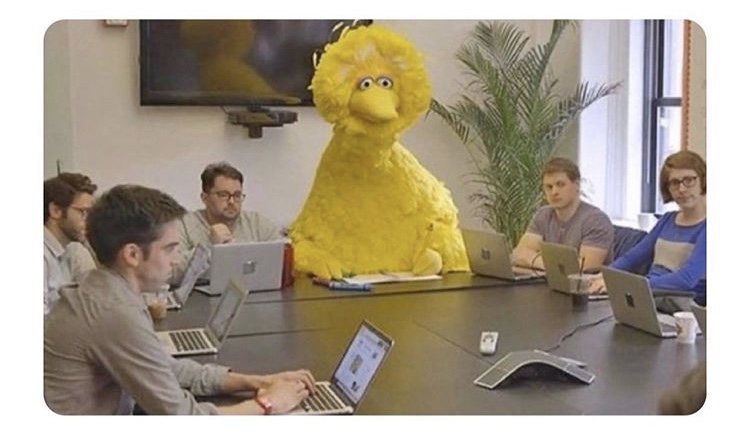
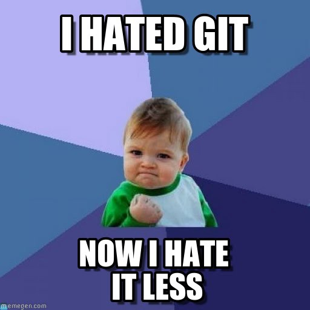

```{r setup, include=FALSE}
knitr::opts_chunk$set(echo = TRUE, fig.align = 'center')
library(tidyverse)
```


<br><br>


```{r, echo=FALSE, out.width = '80%'}

``` 
<center>*GitHub mystery: what is Octocat really? - by wonder TA Mandy* </center>

<br><br>


Github is a really important part of showcasing what you have been working on. It's why we put so much emphasis on pushing regularly and using it. But we also all know that they probably look a bit all over the place right now.

<br><br>

```{r, echo=FALSE, out.width = '60%'}

``` 

<br><br>


So this is what today is about. Cleaning up your profile and repos is a great way to start selling yourself, and to show employers you're active in the coding world. This list isn't a comprehensive one, it's just some links to get you started. 


<hr>


# A note on imposter syndrome

The following collection of links are just guidance... they're not there for you to look at and think "Mine needs to be this way immediately". They are for you to look at and get a general idea of what kind of things people put on them. 

Imposter syndrome is real, but just remember that no one really knows what they are doing. 

<br><br>

```{r, echo=FALSE, out.width = '80%'}

``` 

<br>

<hr>

# Getting your github in order

[Cleaning up your GitHub](https://medium.com/@sharonlin/cleaning-up-your-github-fedaf9e7cef2)

[GitHub: Advantages and tips for a profile](https://impulsate.between.tech/en/tips-github-profile)

[What makes a good GitHub profile](https://codeburst.io/what-makes-a-good-github-profile-ced754284e3d?gi=da7e33f40d27)

[How to present your data science profile on GitHub](https://www.dataquest.io/blog/how-to-share-data-science-portfolio/)

[Good profile README](https://github.com/Z3tt)

<hr>

# GitHub portfolio

[GitHub portfolio tutorial](https://chriskhanhtran.github.io/_posts/2020-01-13-portfolio-tutorial/)

[8 steps to publish your GitHub portfolio](https://medium.com/tunapanda-institute/8-steps-to-publish-your-portfolio-on-github-9d6e6e3d2e84)

[Create a simple portfolio using GitHub pages](https://dev.to/carolmusyoka/how-to-create-a-simple-portfolio-with-github-pages-1ffd)

[Getting started with github pages](https://docs.github.com/en/github/working-with-github-pages/creating-a-github-pages-site)


<hr>


# Writing a good README for your project

[A beginner's guide to writing a kickass README](https://meakaakka.medium.com/a-beginners-guide-to-writing-a-kickass-readme-7ac01da88ab3#:~:text=A%20great%20README%20file%20helps,open%2Dsource%20software%20on%20GitHub.&text=It%20is%20the%20first%20file,basic%20introduction%20to%20the%20software.)

[A curated list of awesome README](https://github.com/matiassingers/awesome-readme)

[How to write a beautiful README](https://blog.bitsrc.io/how-to-write-beautiful-and-meaningful-readme-md-for-your-next-project-897045e3f991)

[A data science approach to writing a good README](https://www.kdnuggets.com/2016/05/algorithmia-data-science-approach-good-github-readme.html)


[Managing your profile README](https://docs.github.com/en/github/setting-up-and-managing-your-github-profile/managing-your-profile-readme)

<hr>

# Some good examples of READMEs

[Rayshader package in R](https://github.com/tylermorganwall/rayshader)

[Janitor package in R](https://github.com/sfirke/janitor)

[Tidytext in R](https://github.com/juliasilge/tidytext)

[gganimate in R](https://github.com/thomasp85/gganimate)


<hr>


# Some past student profiles

[Shiny app project github](https://github.com/daviddbird/team-waste-viz)

[Shiny app project github - good README](https://github.com/kerrmcintosh/acme_inc_shiny_app)

[Good use of pinned projects](https://github.com/dc27)

[Pinning projects](https://github.com/hgw2)

[Good contact details and profile listed](https://github.com/vpetrova13)

[Good profile with skills listed](https://github.com/cproudfoot92)

[Good pinned repos and READMEs](https://github.com/NickCunnington)


# And finally...


Git and GitHub is your friend. Don't be scared of it. It's just a backup system. Once you get the hang of it, it just becomes easy. After cleaning yours up, you'll be more like this:

<br><br>

```{r, echo=FALSE, out.width = '60%'}

``` 
